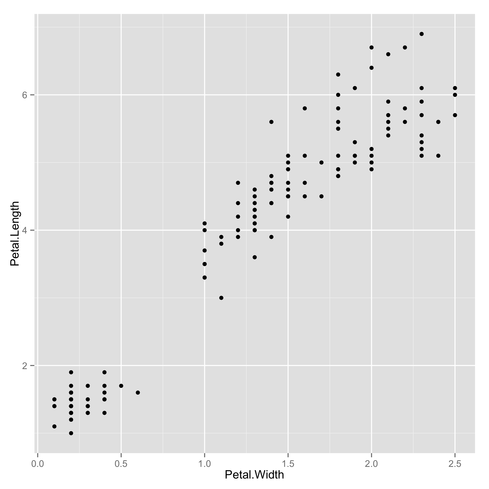
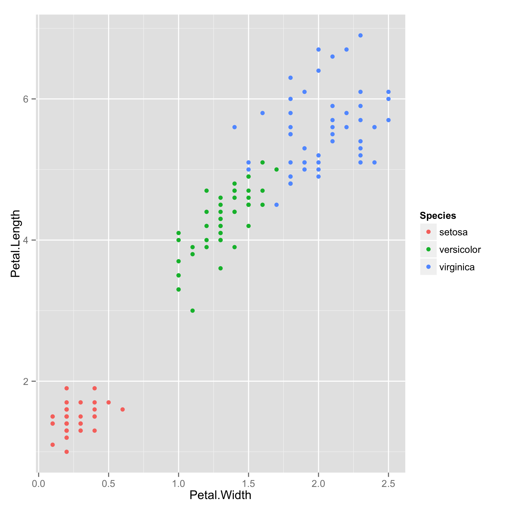
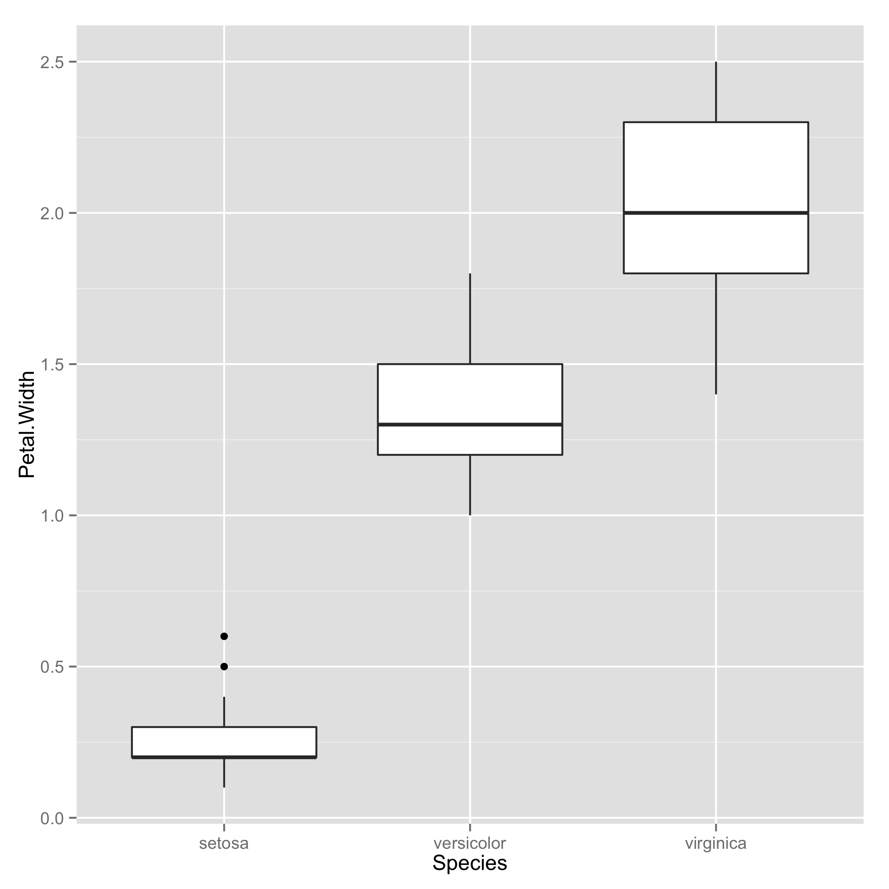
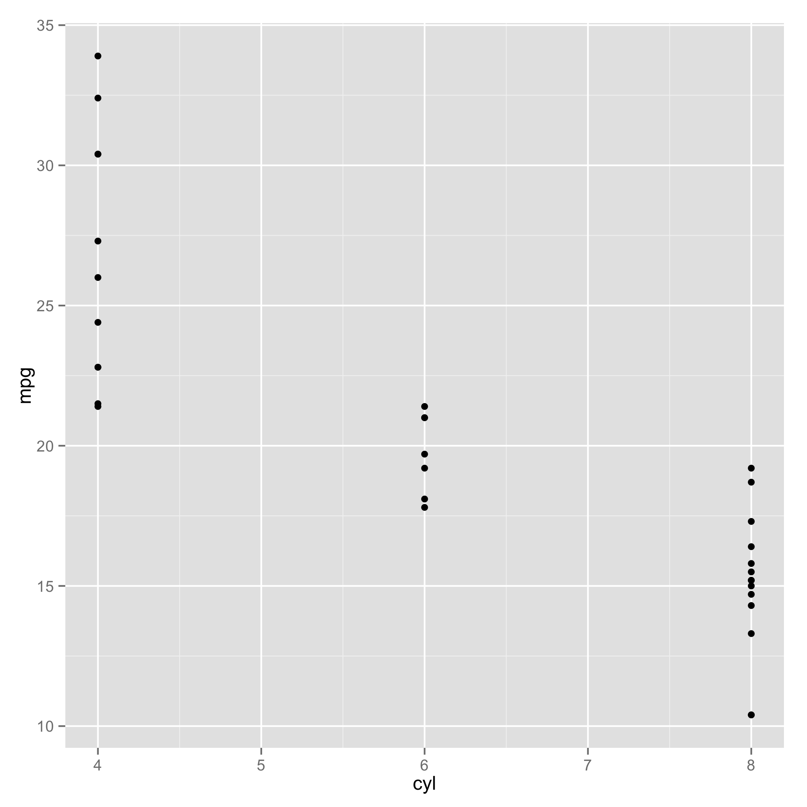
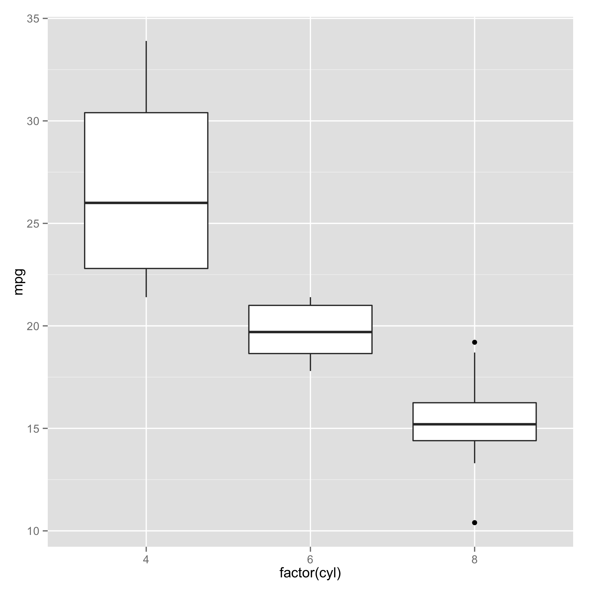
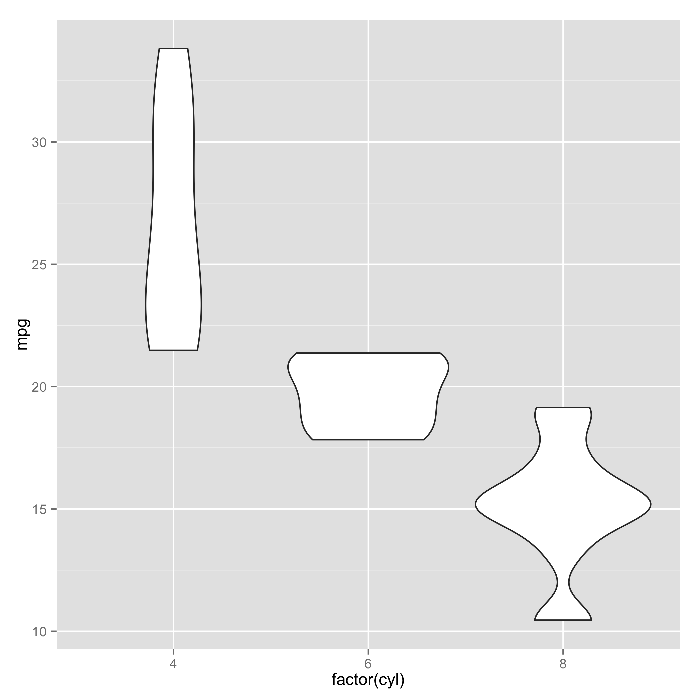

# Basic data analysis and visualization

This tutorial shows how to do basic data analysis using R/ggplot2.  If you want to use already-created tools for quick data analyses, go [here](utilities).

## Starting up

Start by running the R interpreter at the command line:
```
$ R
```

Inside the interpreter, load the library ggplot2:
```
> library(ggplot2)
```

## Load the data

We will use dataset iris stored in examples/iris.csv. Load the dataset and take a look at its columns with the function "head".
```
> data = read.table("examples/iris.csv", header=T, sep=",")
> head(data)
  Sepal.Length Sepal.Width Petal.Length Petal.Width Species
1          5.1         3.5          1.4         0.2  setosa
2          4.9         3.0          1.4         0.2  setosa
3          4.7         3.2          1.3         0.2  setosa
4          4.6         3.1          1.5         0.2  setosa
5          5.0         3.6          1.4         0.2  setosa
6          5.4         3.9          1.7         0.4  setosa
```

## Plot quantitive versus quantitative data

Use a scatter plot to compare two quantitative variables, whose names are the appropriate column names.
```
> ggplot(data, aes(x=Petal.Width, y=Petal.Length)) + geom_point()
```



We can separate the points into groups defined by variable "Species".
```
> ggplot(data, aes(x=Petal.Width, y=Petal.Length, color=Species)) + geom_point()
```



## Plot categorical versus quantitative data

Compare 5-point statistics of Petal.Width (quantitative variable, y-axis) across Species (categorical variable, x-axis).

```
> ggplot(data, aes(x=Species, y=Petal.Width)) + geom_boxplot()
```



## Further analysis of distribution

Here we look at the dataset examples/mtcars, which has information about mileage (column/variable "mpg") of cars with different cylinders (column/variable "cyl").

These two variables are quantitative.  First, look at the scatter plot.
```
> ggplot(mtcars, aes(x=cyl, y=mpg)) + geom_point()
```


Many points overlap, and hence, this is not very useful.

It is more informative to look at the 5-point statistics of mpg across different cylinders. It is best to view the variable "cyl" as categorical/categorical data. (In other words, 4, 6, 8 are categories of cylinders not numerical/quantitative values.)
```
> ggplot(mtcars, aes(x=factor(cyl), y=mpg)) + geom_bar(stat="identity")
```


The boxplot (showing the quartiles of the data distribution) shows that (i) the distribution of mpg of 4 cylinder cars spreads out quite uniformly, (ii) the distribution of mpg of 8 cylinder cars is more concentrated.  It can be even more useful to look at the distributions
```
> ggplot(mtcars, aes(x=factor(cyl), y=mpg)) + geom_violin()
```

