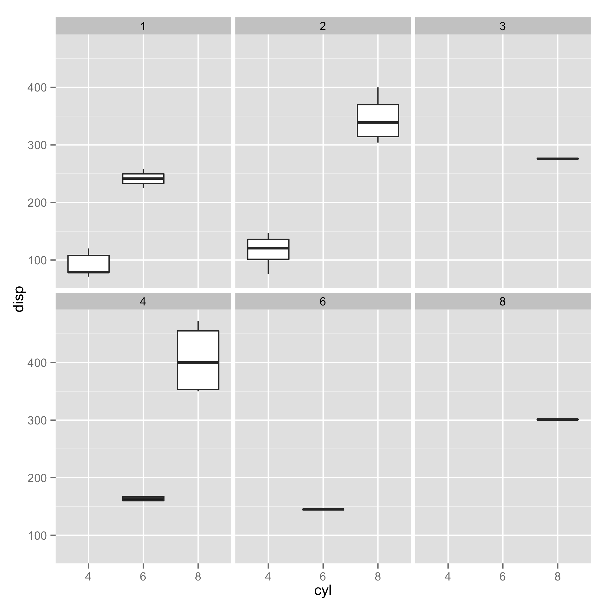
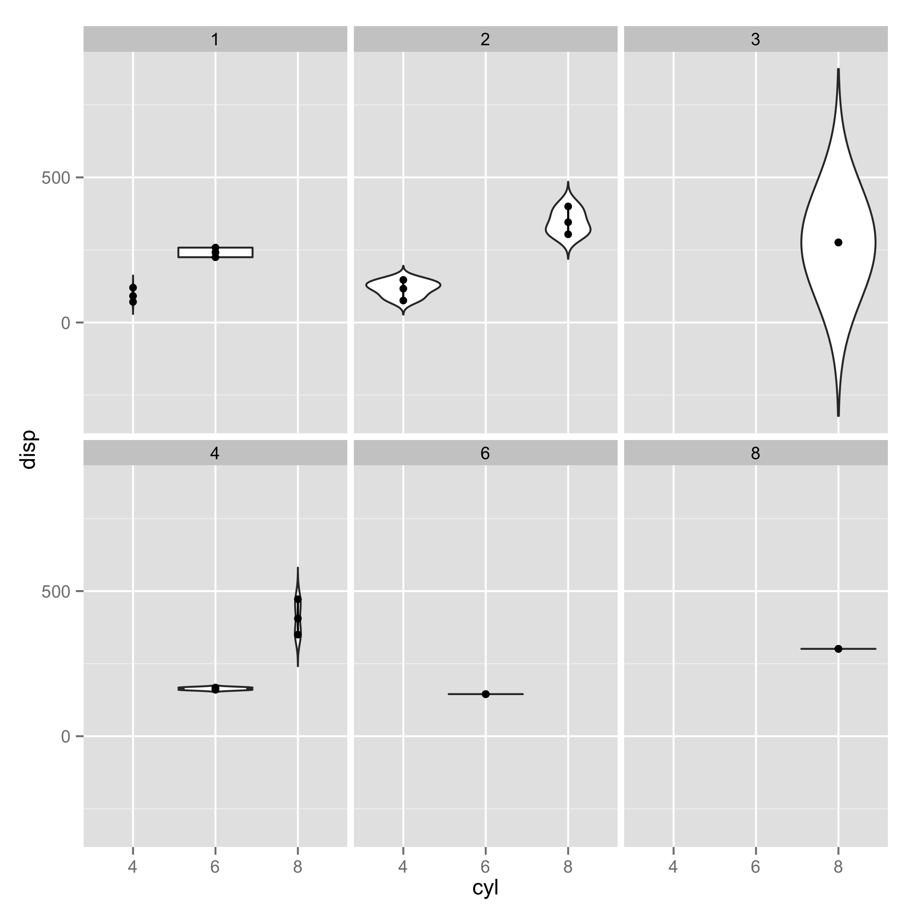

## <a name="cq"></a> Exploring categorical versus quantitative relationships

cq.R - plot categorical (x) versus quantitative (y) data.

#### Usage
```
 cq.R data.csv x y [c]
```

- data.csv : comma-separated file (.csv) or tab-separated file (.tsv).  There must be a header containing column names.  The data must be in long-form.
- x : column name of categorical variable x.
- y : column name of quantitative variable y.
- c : [Optional] column name of category to partition data points.

The output consists of 3 plots: (i) a bar chart that sums up quantitative values for each category, (ii) a box plot that shows quartile statistics of each category, and (iii) a violin plot that shows distributions of values in each category.

#### Examples
```
 cq.R ../examples/mtcars.csv cyl disp
```


Show the same plots for different values of "carb":
```
 cq.R ../examples/mtcars.csv cyl disp carb
```




