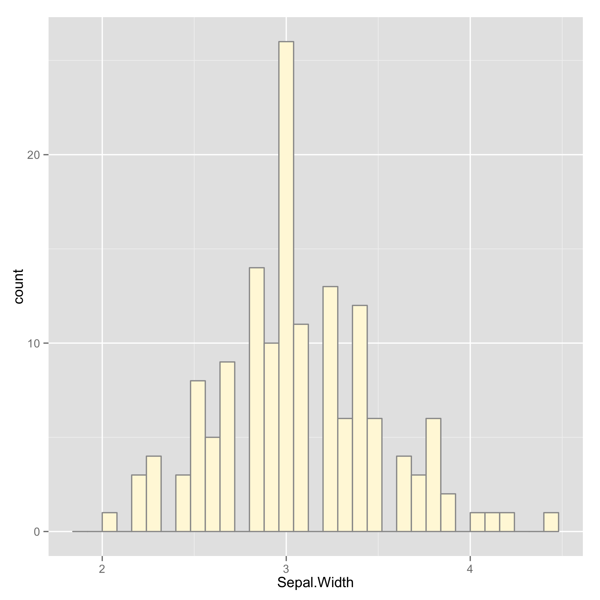
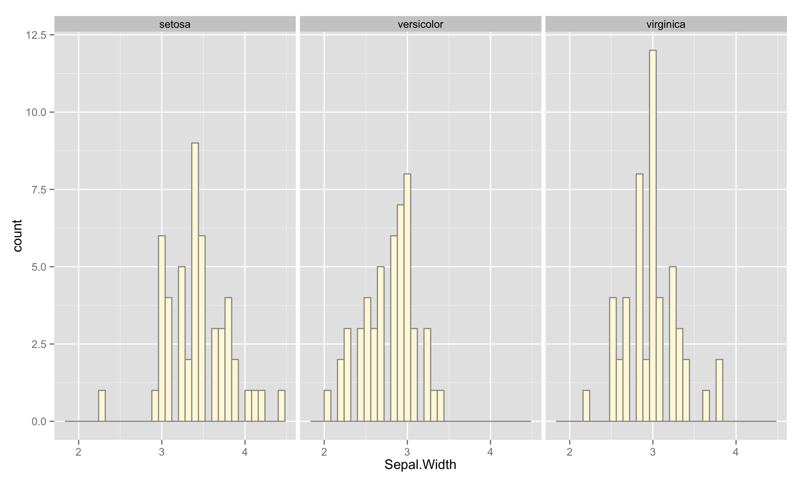
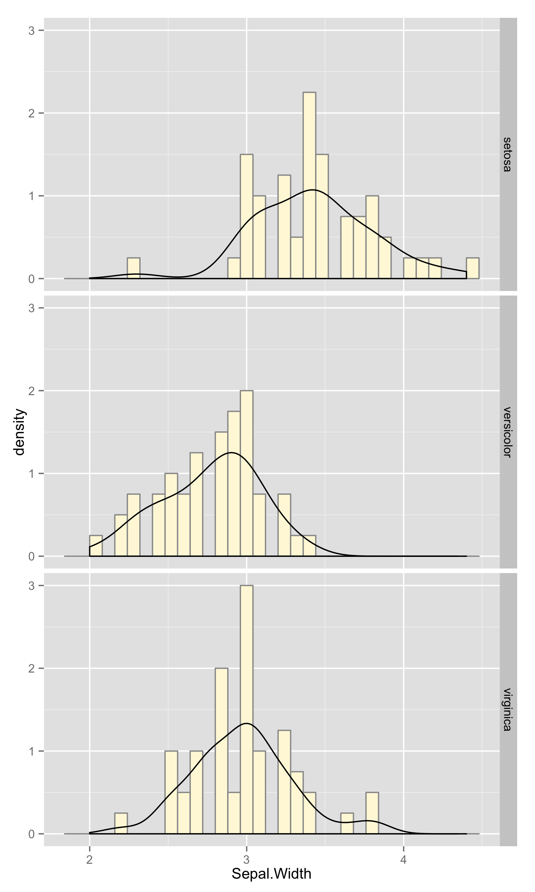
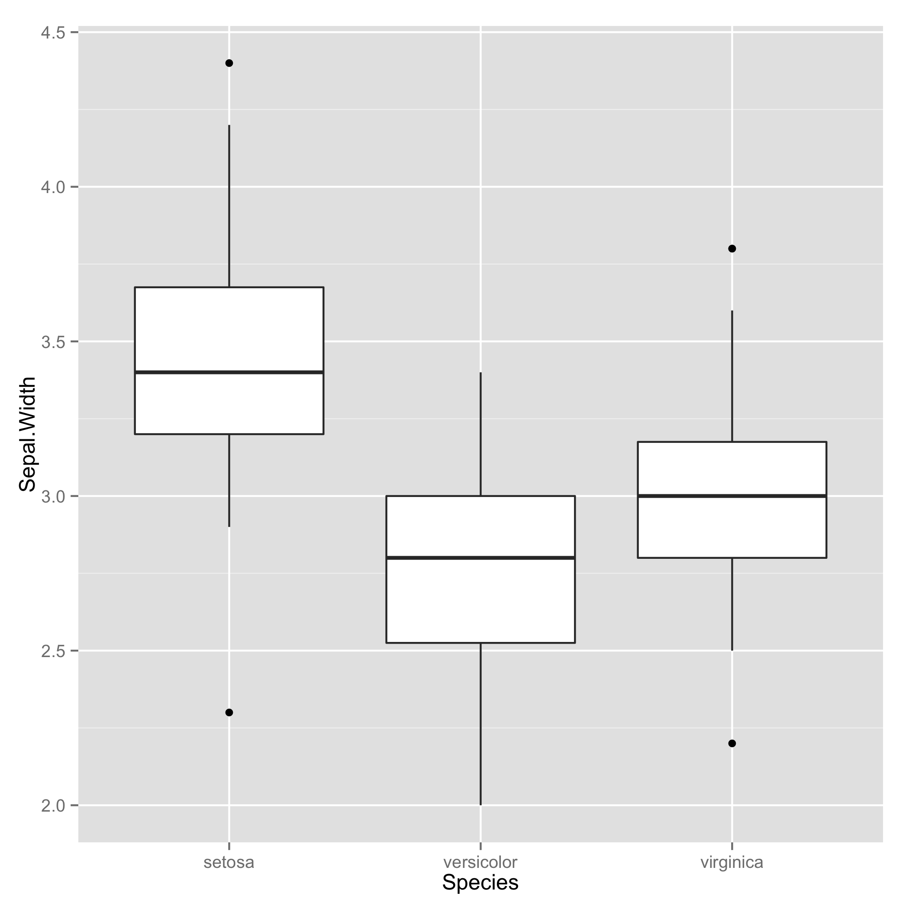
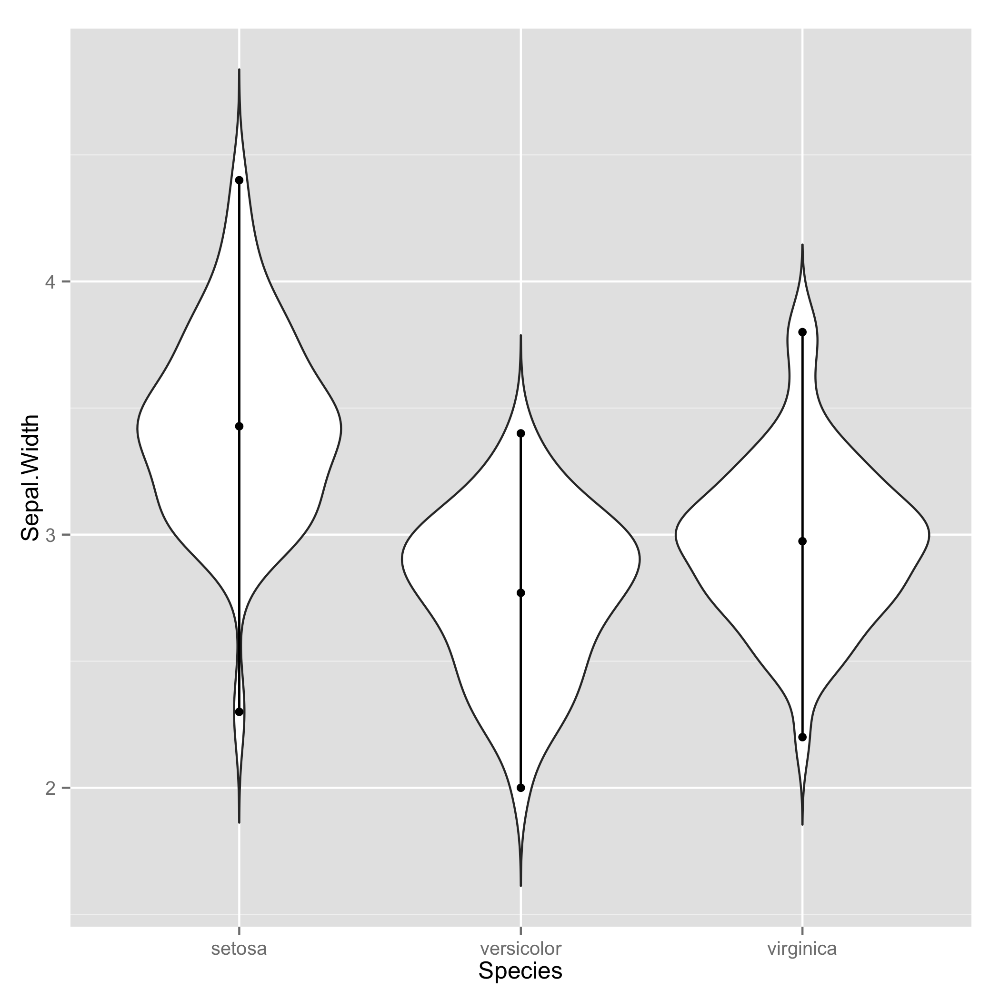

## <a name="density"> Comparing densities and distributions

#### Usage
```
 density.R data.csv x [c]
```

- data.csv : comma-separated file (.csv) or tab-separated file (.tsv).  There must be a header containing column names.  The data must be in long-form.
- x : column name of quantitative variable/density.
- c : Optional. column name of category to partition distribution data.

#### Examples

Looking at the distribution of sepal width from iris data:
```
 density.R ../examples/iris.csv Sepal.Width
```

This produces 2 figures: histogram of absolute count and density.




Looking at the distribution categorized into different species.
```
 density.R ../examples/iris.csv Sepal.Width Species
```

This produces 4 figures.




