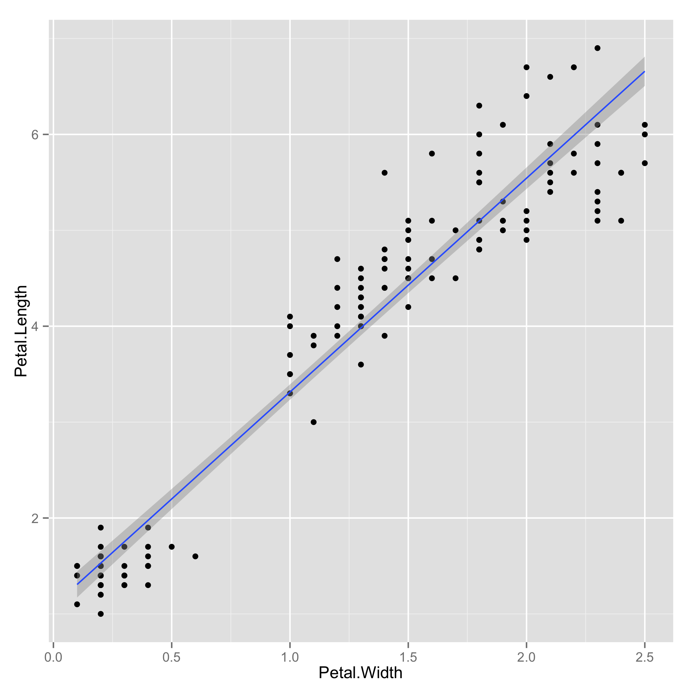

## <a name="qq"></a>Exploring Quantitative vs Quantitative Relationships

qq.R - plot quantitative (x) versus quantitative (y) data, i.e. scatter plots.

#### Usage
```
 qq.R data.csv x y [c]
```

- data.csv : comma-separated file (.csv) or tab-separated file (.tsv).  There must be a header containing column names.  The data must be in long-form.
- x : column name of quantitative variable x.
- y : column name of quantitative variable y.
- c : Optional category variable, which should consist of few categorical values.

#### Examples
```
  qq.R iris.csv Petal.Width Petal.Length
```

The output consists of 3 plots, with and without data fitting.





Categorized further by species.

```
  qq.R iris.csv Petal.Width Petal.Length Species
```


