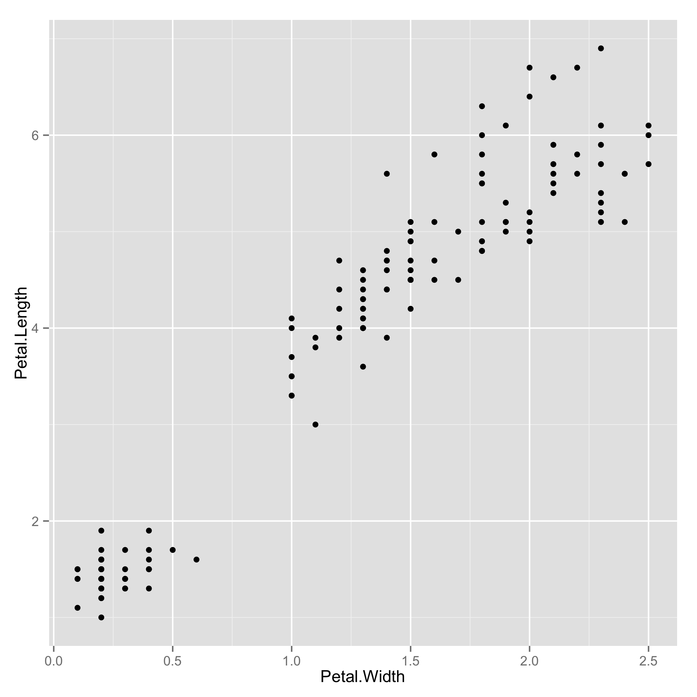
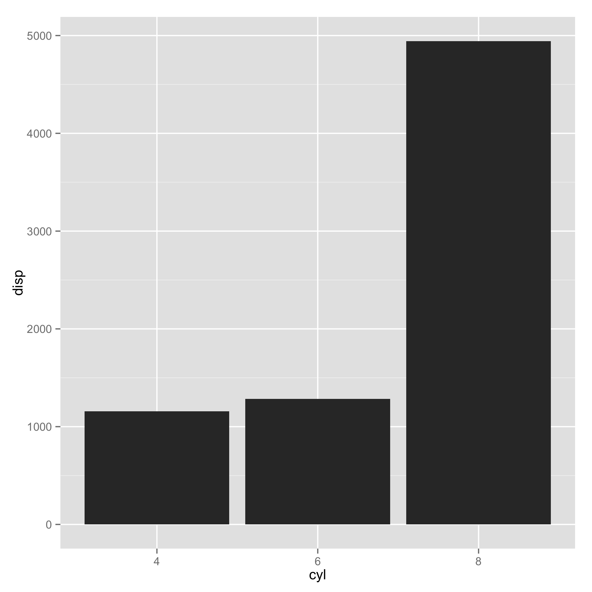
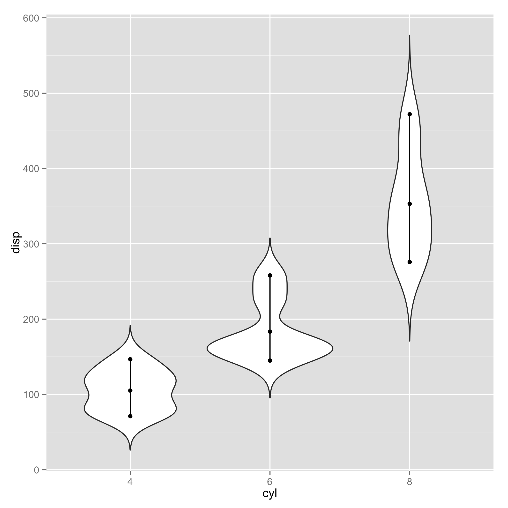
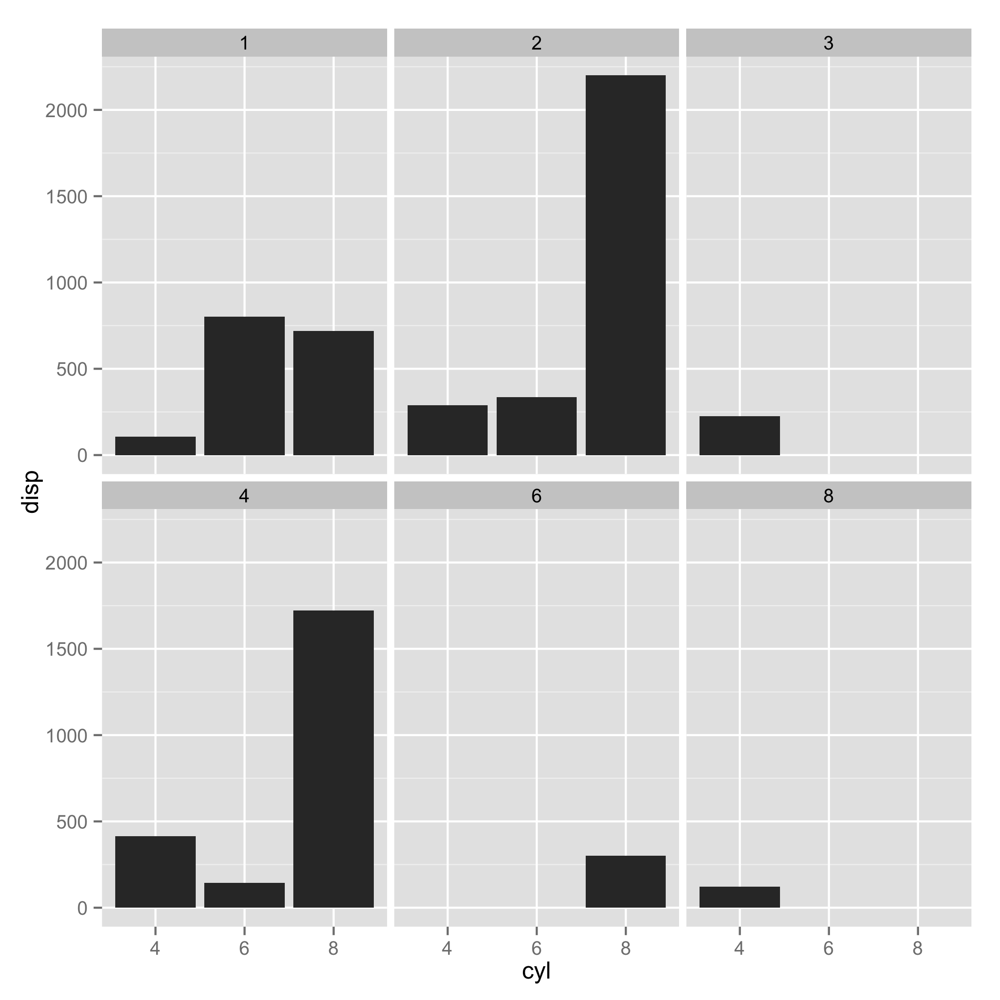
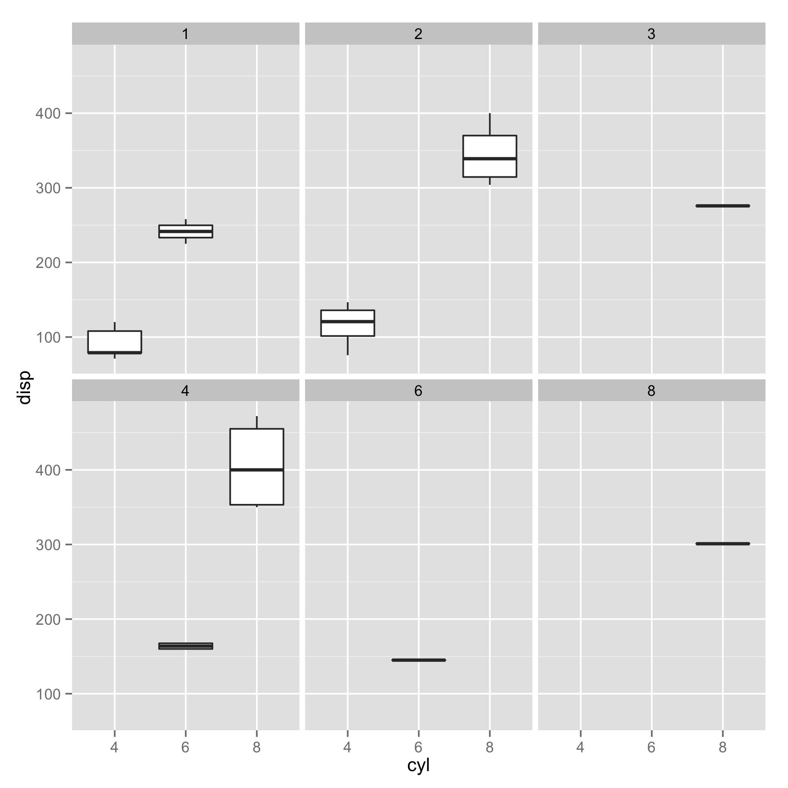
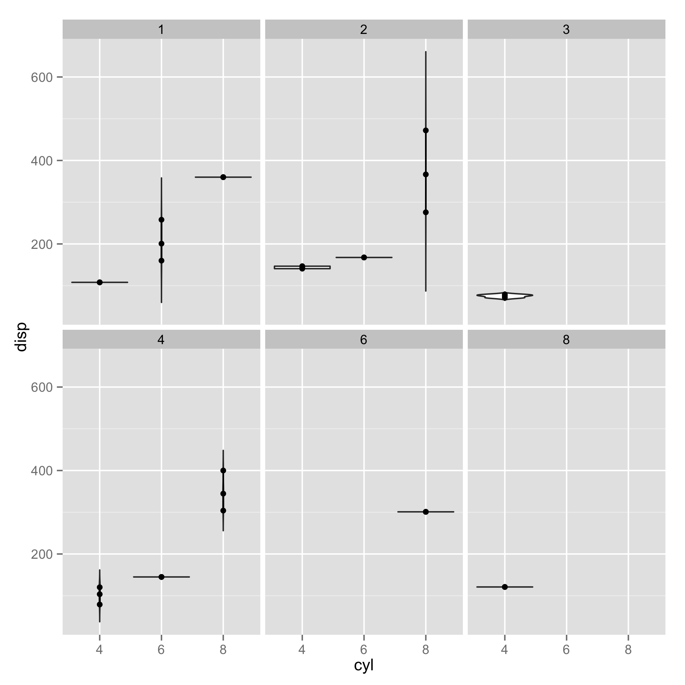

qq.R and cq.R are two separate R scripts that provide plots for (1) quantitative vs quantiative and (2) categorical vs quantiative data.  These scripts facilitates quick analyses of data.  There is no customization of styles and aesthetics.

## Installation
- R
- ggplot2

Tips: (1) create $HOME/bin,  (2) place qq.R and cq.R in $HOME/bin, (3) add $HOME/bin to your PATH (export it in $HOME/.bashrc).

Now you can use these scripts in any directory:
```
Rscript $HOME/bin/qq.R datafile x y [z]
Rscript $HOME/bin/cq.R datafile x y [z]
```

## Quantitative versus Quantitative

qq.R - plot quantitative (x) versus quantitative (y) data, i.e. scatter plots.

#### Usage
```
 Rscript qq.R data_file x y [z]
```

- data_file : comma-separated file (.csv) or tab-separated file (.tsv).  There must be a header containing column names.  The data must be in long-form.
- x : the name of column in data_file representing the x-variable.
- y : the name of column in data_file representing the y-variable.
- z : Optional. The name of column in data_file representing the colorized grouping of data.

#### Examples
```
  Rscript qq.R ../examples/iris.csv Petal.Width Petal.Length
```


Categorized further by species.  In this case, two plots are produced: (i) groups are plotted together in one plot, (ii) groups are separated into different plots.

```
  Rscript qq.R ../examples/iris.csv Petal.Width Petal.Length Species
```


## Categorical versus Quantitative

cq.R - plot categorical (x) versus quantitative (y) data.

#### Usage
```
 Rscript cq.R data_file x y [g]
```

- data_file : comma-separated file (.csv) or tab-separated file (.tsv).  There must be a header containing column names.  The data must be in long-form.
- x : the name of column in data_file representing the x-variable.
- y : the name of column in data_file representing the y-variable.
- z : Optional. The name of column in data_file, whose values partition (x,y) into different plots.

The output consists of 3 plots: (i) a bar chart that sums up quantitative values for each category, (ii) a box plot that shows quartile statistics of each category, and (iii) a violin plot that shows distributions of values in each category.

#### Examples
```
 Rscript cq.R ../examples/mtcars.csv cyl disp
```





Show the same plots for different values of "carb":
```
 Rscript cq.R ../examples/mtcars.csv cyl disp carb
```



