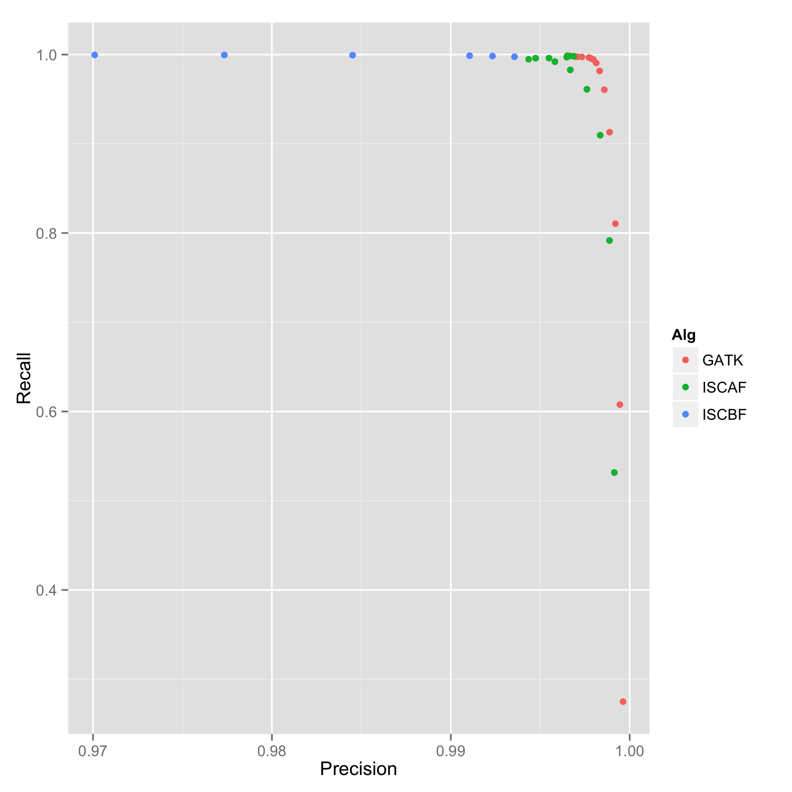

qq.R and cq.R are two separate R scripts that provide plots for (1) quantitative vs quantiative and (2) categorical vs quantiative data.  These scripts facilitates quick analyses of data.  There is no customization of styles and aesthetics.

## Installation
- R
- ggplot2

## Scripts

1. qq.R - plot quantitative (x) versus quantitative (y) data, i.e. scatter plots.

Usage:
```
 Rscript qq.R data_file x y [z]
```

- data_file : comma-separated or tab-separated file, with a header and column names.  The data must be in long-form.
- x : the name of column in data_file representing the x-variable.
- y : the name of column in data_file representing the y-variable.
- z : Optional. The name of column in data_file representing the colorized grouping of data.

Example:
```
  Rscript qq.R  ../examples/snp_caller.tsv Precision Recall Alg
```


Other examples:
```
  Rscript qq.R ../examples/iris.csv Petal.Width Petal.Length
  Rscript qq.R ../examples/iris.csv Petal.Width Petal.Length Sepal.Width
```

2. cq.R - plot categorical (x) versus quantitative (y) data.

Usage:
```
 Rscript cq.R data_file x y [g]
```

- data_file : comma-separated or tab-separated file, with a header and column names.  The data must be in long-form.
- x : the name of column in data_file representing the x-variable.
- y : the name of column in data_file representing the y-variable.
- z : Optional. The name of column in data_file, whose values partition (x,y) into different plots.

The output consists of 3 plots: (i) a bar chart that sums up quantitative values for each category, (ii) a box plot that shows quartile statistics of each category, and (iii) a violin plot that shows distributions of values in each category.

Examples:
```
 Rscript cq.R ../examples/mtcars.csv cyl disp
```


Show the same plots for different values of "carb":
```
 Rscript cq.R ../examples/mtcars.csv cyl disp carb
```


