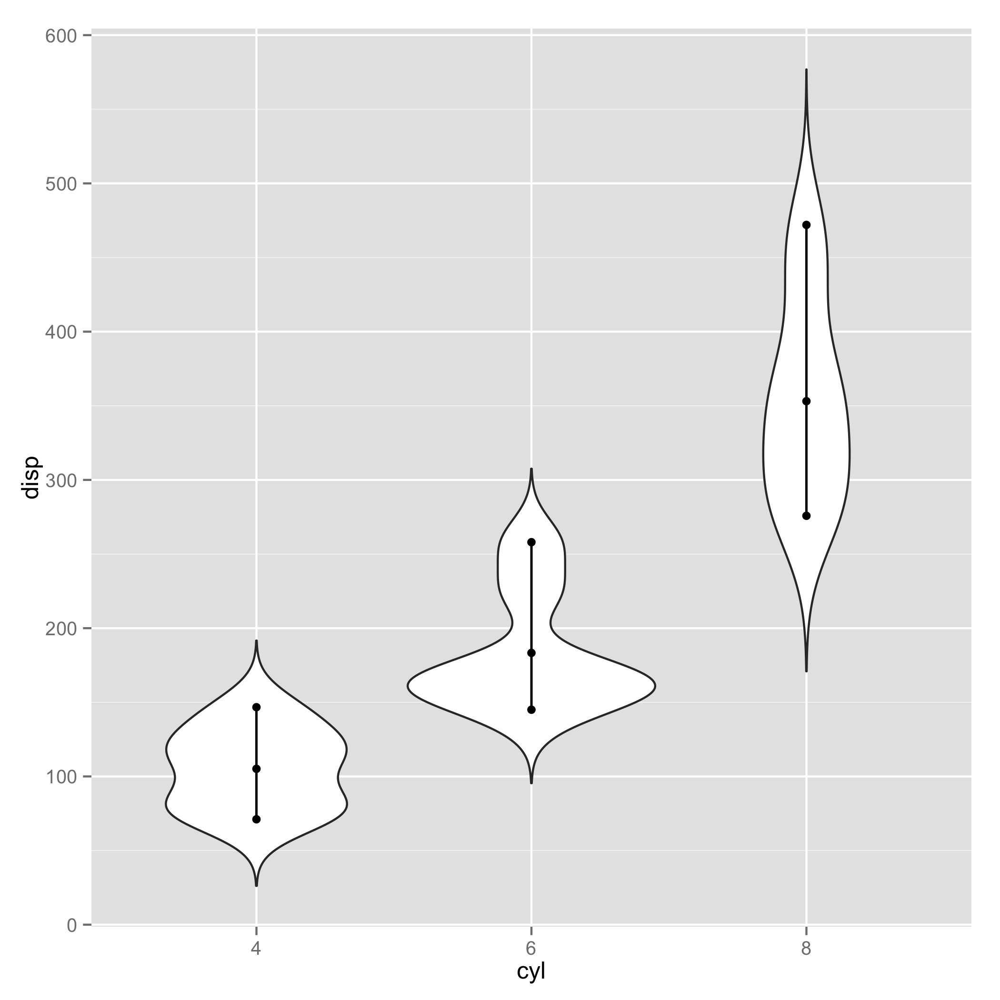
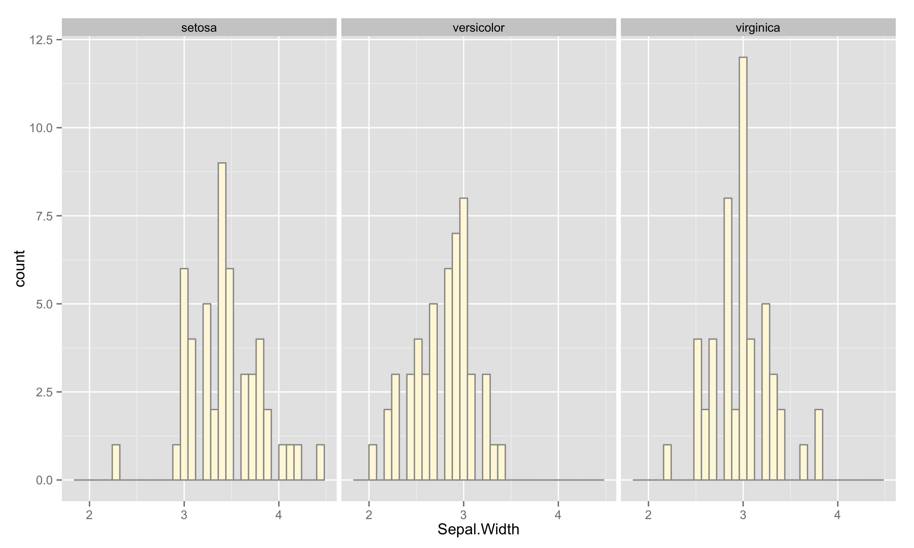

qq.R, cq.R and density.R help facilitate quick analyses of data.

-  qq.R helps explore [quantitative vs quantiative relationships](#qq).
```
     qq.R data.csv x y [z]
```
-  qc.R helps explore categorical vs quantiative relationships.
```
     cq.R data.csv x y [z]
```
-  density.R helps compare distributions.
```
     density.R data.csv x [c]
```

## Installation

#### Dependencies
- R
- ggplot2

#### Configuration
- At command prompt: make $HOME/bin
- Move R scripts into $HOME/bin
- At command prompt: chmod u+x $HOME/bin/qq.R; chmod u+x $HOME/bin/cq.R
- In $HOME/.bashrc: PATH=$PATH:$HOME/bin
- At command prompt: source $HOME/.bashrc


## <a name="qq"></a>Exploring Quantitative vs Quantitative Relationships

qq.R - plot quantitative (x) versus quantitative (y) data, i.e. scatter plots.

#### Usage
```
 qq.R data.csv x y [z]
```

- data.csv : comma-separated file (.csv) or tab-separated file (.tsv).  There must be a header containing column names.  The data must be in long-form.
- x : the name of column in data.csv representing the x-variable.
- y : the name of column in data.csv representing the y-variable.
- z : Optional. The name of column in data.csv representing the colorized grouping of data.

#### Examples
```
  qq.R ../examples/iris.csv Petal.Width Petal.Length
```


Categorized further by species.  In this case, two plots are produced: (i) groups are plotted together in one plot, (ii) groups are separated into different plots.

```
  qq.R ../examples/iris.csv Petal.Width Petal.Length Species
```


## Categorical versus Quantitative

cq.R - plot categorical (x) versus quantitative (y) data.

#### Usage
```
 cq.R data.csv x y [g]
```

- data.csv : comma-separated file (.csv) or tab-separated file (.tsv).  There must be a header containing column names.  The data must be in long-form.
- x : the name of column in data.csv representing the x-variable.
- y : the name of column in data.csv representing the y-variable.
- z : Optional. The name of column in data.csv, whose values partition (x,y) into different plots.

The output consists of 3 plots: (i) a bar chart that sums up quantitative values for each category, (ii) a box plot that shows quartile statistics of each category, and (iii) a violin plot that shows distributions of values in each category.

#### Examples
```
 cq.R ../examples/mtcars.csv cyl disp
```





Show the same plots for different values of "carb":
```
 cq.R ../examples/mtcars.csv cyl disp carb
```


## Analyzing densities and distributions

#### Usage
```
 density.R data.csv x [c]
```

- data.csv : comma-separated file (.csv) or tab-separated file (.tsv).  There must be a header containing column names.  The data must be in long-form.
- x : the name of column in data.csv representing the x-variable.
- c : Optional. the name of column in data.csv representing the category.

#### Examples

Looking at the distribution of sepal width from iris data:
```
 density.R ../examples/iris.csv Sepal.Width
```

This produces 2 figures: histogram of absolute count and density.


Looking at the distribution categorized into different species.
```
 density.R ../examples/iris.csv Sepal.Width Species
```

This produces 4 figures.




